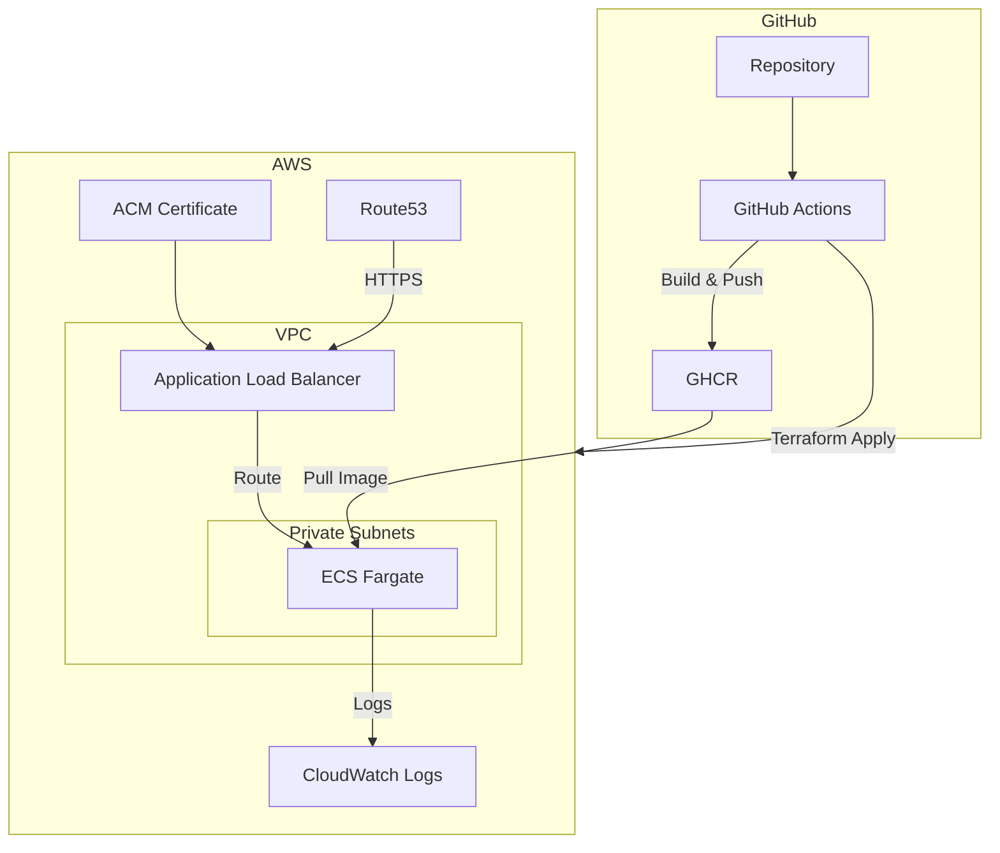

# CredPal DevOps Assessment

Production-ready Node.js application with CI/CD and Terraform infrastructure.

---

## Table of Contents

- [Application](#application)
- [Architecture](#architecture)
- [How to Run Locally](#how-to-run-locally)
- [How to Access the App](#how-to-access-the-app)
- [How to Deploy](#how-to-deploy)
- [Key Decisions](#key-decisions)

---

## Application

| Item | Value |
|------|-------|
| Endpoints | `GET /health`, `GET /status`, `POST /process` |
| Port | 3000 |

---

## Architecture



**Flow:** PR and push to `main` trigger the pipeline. Test runs on all. On push/merge to `main`: Build → Push image to GHCR → Manual approval → Terraform apply → ECS pulls image, ALB routes traffic via HTTPS.

---

## How to Run Locally

**Prerequisites:** Node.js 20+, or Docker & Docker Compose

### Option 1: Node.js

```bash
cd app
npm install
npm start
```

### Option 2: Docker Compose

```bash
cd app
cp .env.example .env
# Edit .env: POSTGRES_USER, POSTGRES_PASSWORD, POSTGRES_DB
docker compose up -d
```

---

## How to Access the App

| Environment | URL |
|-------------|-----|
| Local | http://localhost:3000 |
| Deployed | `terraform output app_url` or configured domain (e.g. https://credpal.infra.dareyio.com) |

---

## How to Deploy

**Prerequisites:** AWS CLI configured, Terraform 1.5+, S3 bucket and DynamoDB table for state (see [DEPLOYMENT.md](terraform/DEPLOYMENT.md))

### Manual Deployment

```bash
cd terraform
terraform init -backend-config=environments/prod/backend.hcl
terraform plan -var-file=environments/prod/terraform.tfvars
terraform apply -var-file=environments/prod/terraform.tfvars
```

### CI/CD Deployment

1. Add GitHub Secrets: `AWS_ACCESS_KEY_ID`, `AWS_SECRET_ACCESS_KEY`
2. Configure `production` environment with required reviewers (Settings → Environments)
3. Push to `main` → Build runs → Deploy waits for approval → Terraform apply

After a successful deploy, paste the public URL (e.g. https://credpal.infra.dareyio.com) in your browser to load the app.

**Note:** Set `container_image` in `terraform/environments/prod/terraform.tfvars` before first apply. For CI/CD, make the GHCR package public so ECS can pull the image.

**Database credentials:** If the app uses a database, DB credentials will be stored in AWS Secrets Manager and injected into the ECS task at runtime. No secrets will be committed to the repository.

---

## Key Decisions

### Security

| Decision | Implementation |
|----------|----------------|
| No secrets in GitHub | `.env` for local (gitignored). CI uses GitHub Secrets for AWS. No hardcoded credentials. |
| Non-root container | Dockerfile runs as `appuser` (UID 1001) |
| HTTPS | ACM certificate with Route53 DNS validation. HTTP redirects to HTTPS when domain is set. |

**Repository visibility:** A private repo would be preferred for security. This repo is public so reviewers can access it for the assessment.

### CI/CD

| Decision | Implementation |
|----------|----------------|
| Triggers | Push and PR to `main`. Build and deploy only on push to `main`. |
| Pipeline | Test → Build → Deploy (sequential). Deploy requires manual approval. |
| Registry | GitHub Container Registry. Uses `GITHUB_TOKEN` for push. |
| Deployment | Terraform apply in deploy job. Uses `latest` image tag. |

### Infrastructure

| Decision | Implementation |
|----------|----------------|
| Compute | ECS Fargate. Rolling deployment (min 100%, max 200%). Circuit breaker with rollback. |
| Networking | VPC with public and private subnets. NAT gateway for egress. |
| Load balancing | ALB with health checks on `/health`. |
| Observability | CloudWatch Logs (14-day retention). Request logging in app. |
| State | S3 + DynamoDB per environment (dev, staging, prod). |
